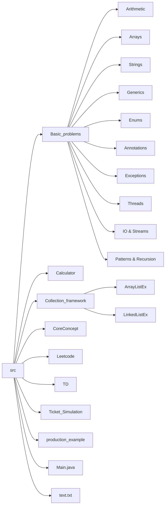

# Repository Structure 

Below is a high-level view of the `src/` folder and its main sub-folders. This diagram helps visualize how code is organized by topic and functionality, making it easier to see where each exercise or example lives.

#  Basic_problems

This folder is a playground of small Java exercises, grouped by concept. Each file demonstrates a focused idea or algorithm, often in a self-contained `main` method that you can run directly.

## Arithmetic Operations

These classes showcase basic math and bitwise tricks. They are good starting points to understand how low-level operations feed into higher-level arithmetic logic.

| File                              | Purpose                                      | Related Examples                      |
|-----------------------------------|----------------------------------------------|---------------------------------------|
| **Adding1BitwiseOperator.java**   | Increment a number using bitwise operations. | bitwiseAND.java, TwoPower_FindingUsing_Bit.java |
| **Arifmetic_Operations.java**     | Simple add, subtract, multiply, divide.      | Simple_Calculator.java                |
| **Binary_Addition.java**          | Add two binary numbers represented as strings.| CounterBit.java (bit reasoning)       |
| **MultiplyUsingBit.java**         | Multiply using only bit-shifts and addition. | SwappingUsingBit.java                 |
| **TwoPower_FindingUsing_Bit.java**| Find powers of two with bitwise checks.      | EvenOrOddUsingBit.java                |
| **ProductOFNum.java**             | Read two numbers and print their product.    | SImpleAdd_UsingCommandLine.java       |
| **SImpleAdd_UsingCommandLine.java** | Add numbers passed as command-line args.   | CommandLine.java (CoreConcept)        |
| **Simple_Calculator.java**        | Use a `switch` to build a text-based calculator. | Calculator/Main.java                  |
| **DevisionTwoNum.java**           | Divide two numbers and handle integer division. | ModifyArifmeticExxception.java        |

Typical patterns used here:

- Reading input with `Scanner` or `BufferedReader`.
- Converting `String` to numeric types using `Integer.parseInt` or similar.
- Demonstrating integer vs floating-point behavior, and sometimes exception handling.

## Array Manipulations

These classes demonstrate how to traverse arrays, perform searches, sort data, remove elements, and compute aggregates. They often model manual re-implementation of what collections already provide.

| File                       | Purpose                                    | Related Examples       |
|----------------------------|--------------------------------------------|------------------------|
| **ArrayCopy.java**         | Copy arrays manually without utility APIs. | Remove_element.java    |
| **AverageArray.java**      | Compute average of array elements.         | SumArray.java          |
| **SumArray.java**          | Add up values in an array.                 | AverageArray.java      |
| **RemoveEvenNumArray.java**| Filter even numbers out of an array.       | SpecificValue.java     |
| **Remove_element.java**    | Remove a given element and shift contents. | ResizableInt.java      |
| **SortArray.java**         | Sort numeric (and optionally string) array.| sortArray.java (CoreConcept) |
| **SpecificValue.java**     | Check if an array contains a given value.  | FindIndex.java         |
| **FindIndex.java**         | Print indices where a target appears.      | SpecificValue.java     |
| **ResizableInt.java**      | Growable integer array implementation.     | ArrayListEx1.java      |
| **MultipleString.java**    | Hold and process multiple strings in an array. | ListSort.java       |

Key ideas demonstrated:

- Classic index-based `for` loops and enhanced `for-each` loops.
- Manual resizing by allocating a new array and copying elements.
- Simple linear search versus relying on APIs like `Arrays.binarySearch`.

## String Processing

These files range from simple equality checks to more subtle tasks like ignoring case, handling Unicode, or counting words. They reinforce string immutability and method usage.

| File                        | Purpose                                          | Related Examples                    |
|-----------------------------|--------------------------------------------------|-------------------------------------|
| **Anagram.java**            | Check if two words are anagrams by sorting or counting characters. | PalindromeIgnore.java              |
| **CheckPalindrome.java**    | Verify palindrome property of a string.          | PalindromeString.java (Leetcode)    |
| **PalindromeIgnore.java**   | Palindrome check ignoring spaces or punctuation. | UnicodeAware.java                   |
| **UnicodeAware.java**       | Handle multibyte characters safely.             | Streams.java                        |
| **Pattern_JAVA.java**       | Print custom word/letter patterns using loops.  | Diamond.java, Pyramid.java          |
| **StringEx1–StringEx17.java** | 17 mini-exercises (e.g., `toCharArray()`, `regionMatches()`, `getBytes()`, equality, vowels extraction). | WordCountStream.java, Streams.java |
| **StringLength.java**       | Measure string length manually without `length()`. | StringEx2.java                      |
| **LengthStringInStream.java** | Process string length using streams or readers.| WordCountStream.java                |
| **CountWovelsLambda.java**  | Count vowels with a lambda-based approach.      | VowelException.java                 |
| **WordCountStream.java**    | Count words separated by whitespace from input. | Streams.java                        |
| **MultipleString.java**     | Work with multiple words together in loops.     | ListSort.java                       |

Common string techniques in these exercises:

- Converting to `char[]` for character-level processing.
- Using `equals`, `equalsIgnoreCase`, `startsWith`, `endsWith`, and `regionMatches`.
- Converting between bytes and strings using `getBytes()` and encodings.

## Generics

These examples show how to design generic classes and methods, handle type parameters, and use wildcards to control variance. They complement more in-depth generics code in `CoreConcept`.

| File                       | Purpose                                                   | Related in CoreConcept       |
|----------------------------|-----------------------------------------------------------|------------------------------|
| **Generics.java**          | Generic `Number<T>` wrapper class for storing any type.   | Intro_Generic.java           |
| **GenTypeParam.java**      | Illustrate type parameters and generic methods.           | TwoGen.java                  |
| **GenCompare.java**        | Compare generic values with bounds or `Comparable`.       | TwoGenAvg.java               |
| **GenDiamondOperator.java**| Use diamond operator `<>` to infer type parameters.       | Intro_Generic.java           |
| **GenEx2.java**, **GenEx3.java** | Misc generic operations and method examples.       | SpecialGen.java              |
| **GenIsIN.java**           | Check if an element is “in” an array via generic methods.| ArrayGen.java                |
| **GenNumberStats.java**    | Compute numeric statistics with bounded generics.         | TwoGenAvg.java               |
| **GenSp.java**             | Specialized generic type with additional constraints.     | SpecialGen.java              |
| **GenStack.java**          | A stack implementation with generics for any element type.| AStack.java (CoreConcept)   |
| **GenSwapArray.java**      | Swap elements in generic arrays.                          | sortArray.java               |
| **TwoTypeParam.java**      | Class using two type parameters to store a pair.          | TwoGen.java                  |

They reinforce concepts like:

- Type erasure and compile-time checks.
- `? extends` vs `? super` for read/write flexibility.
- Reusing generic containers instead of writing many specific ones.

## Enums

Enums in this project go beyond simple constants by including fields, constructors, and methods. They model domain-specific data like roles, planets, and days.

| File               | Purpose                                              |
|--------------------|------------------------------------------------------|
| **WeekEnum.java**  | Basic days-of-week enum and `values()` demonstration.|
| **EarthEnum.java** | Planets with distance from Sun as a `long` field.    |
| **DaysInEnum.java**| Associate extra numeric data or labels with days.   |
| **AdvancedEnum.java** | Salary multiplier and bonus via enum constructor.  |
| **ColorsEnum.java**  | Define color constants with optional metadata.     |
| **SeasonsEnum.java** | Model seasons as enums and maybe attach messages.  |
| **MonthEnum.java**   | Represent months and possibly number of days.      |

`AdvancedEnum.java` in particular demonstrates:

- Enum-specific constructors that assign per-constant values.
- Instance methods like `annualBonus()` that do calculations.
- Override of `toString()` to return human-friendly descriptions.

## Annotations

These files explore both built-in annotations from the JDK and custom annotations with different retention policies. They also show how to inspect annotations at runtime using reflection.

- **AnnotationBasic.java**  
  Introduces syntax for declaring and applying custom annotations on classes or methods.

- **Built_in_anno.java**  
  Uses `@SuppressWarnings` and `@Override` to show their purpose and effect.  
  Demonstrates overriding a method in a subclass and using `super` to delegate.

- **CustomRetention.java**  
  Defines custom annotations with `@Retention` and tests their visibility in compiled classes.

- **SpecifyRetentionPolicy.java**  
  Explicitly contrasts `SOURCE`, `CLASS`, and `RUNTIME` retention using three annotations and reflection-based retrieval.

- **TryingAnnotation.java**  
  Combines custom annotations with regular classes to see how they interact.

- **AnnotatedElements.java**, **ExtendedReflection.java**  
  Explore how to get annotations from methods, classes, and parameters using reflection APIs.

These help you understand when annotations are visible and how tooling and frameworks can use them to drive behavior.

## Exception Handling

These files focus on checked vs unchecked exceptions, custom exception types, and proper `try-catch` use. They give small but concrete examples of error handling strategies.

- **CheckedvsUnchecked.java**  
  Compares exceptions that must be declared or caught with those that do not require such handling.

- **ExampleExceptionForChain.java**  
  Demonstrates exception chaining with `initCause()` or constructors that take a cause.  
  Shows how to preserve original error context.

- **ExceptionOddNumber.java**  
  Throws a custom exception if a number is odd when an even number is required.

- **VowelException.java**  
  Defines `VowelsExceotions` and throws it when a string lacks vowels, then catches and rethrows.

- **ConsoleExc.java**  
  Illustrates catching I/O errors that occur while interacting with the console.

These examples collectively practice:

- Declaring `throws` on methods.
- Using `try-catch-finally` or `try-with-resources`.
- Communicating validation errors through domain-specific exceptions.

## Concurrency (Threads)

Classic threading problems are implemented using `Thread`, `Runnable`, and sometimes low-level primitives like `wait()` and `notify()`. These files show how to coordinate multiple threads safely.

| File                           | Purpose                                        |
|--------------------------------|------------------------------------------------|
| **GreetingThread.java**        | Two threads printing “Hello” and “World” with join. |
| **OddEvenThread.java**         | Print odd & even numbers in separate threads.  |
| **EvenAndOddNumbers.java**     | Run `EvenThread` and `OddThread` sequentially using `join()`. |
| **OrderThread.java**           | Enforce thread execution order with `join()`.  |
| **CounterUsingThreeThreads.java** | Three threads incrementing a shared counter, often synchronized. |
| **BankThreadProblem.java**, **BankThread.java** | Model race conditions on shared account data. |
| **BankingExample.java**        | Example of synchronized methods in a banking scenario. |
| **JustRememberThread.java**    | Brief demo to remember thread basics.         |
| **SumOfOddNumsUsingThread.java** | Use threads to sum odd numbers in a range.   |
| **WorkerThread.java**          | Ping-Pong alternation using `wait()` and `notify()`. |
| **RecapThread.java**           | Recap of multi-threading concepts in one example. |
| **GreetingThread.java**        | also shows `isAlive()` checks and timing.     |

These classes highlight:

- Thread lifecycle (`start`, `join`, `isAlive`).
- Race conditions on shared objects if unsynchronized.
- Low-level coordination via flags and monitor methods (`wait`/`notify`).

## IO & Streams

IO-related classes show how to handle console input, file operations, and buffered reading/writing. They frequently combine text processing with IO.

- **IOfile.java**  
  Demonstrates basic file reading and writing with streams and readers.

- **ReadingFileStream.java**  
  Writes to `text2.txt` using `FileWriter` and then reads it back with `FileReader`.

- **PrintWriter.java**  
  Wraps `System.out` with `java.io.PrintWriter` to write buffered text and flush explicitly.

- **StoringInBuffer.java**  
  Shows how to store input in a buffer before processing it further.

- **Streams.java**  
  Uses `BufferedReader` and `InputStreamReader` to read a full line and echo it back.

- **TakingStringStream.java**  
  Collects input strings and possibly processes them using stream-style iteration.

- **WordCountStream.java**  
  Reads a line, normalizes whitespace, splits on regular expressions, and counts words.

- **StringEx1.java**  
  Reads `data.csv` and splits lines into columns, then prints column-wise output.

Concepts explored:

- Difference between byte streams and character streams.
- Handling encodings via `InputStreamReader`.
- Working with files relative to the project structure.

## Patterns & Recursion

These files combine nested loops to print shapes, and recursive methods to solve classic problems. They exercise logical reasoning with indices and call stacks.

- **Diamond.java**, **Pyramid.java**, **Triangle.java**  
  Use nested loops to calculate spaces and stars, building symmetric shapes.

- **Face_Print.java**  
  Prints a simple ASCII-art face using characters and fixed formatting.

- **Grid10x10.java**  
  Prints a 10×10 grid of `-`, useful for understanding 2D iteration.

- **L_AlF.java**, **Pattern_JAVA.java**  
  Draw letter shapes or patterns related to words.

- **Factorial.java**, **FactorialLambda.java**  
  Compute factorial using both normal recursion and a lambda-based approach.

- **Fibonacci_number.java**, **number.java**  
  Compute Fibonacci numbers recursively and log the recursive flow.

- **GCD_Recursive.java**  
  Recursive Euclidean algorithm for greatest common divisor.

- **RecursiveExponential.java**  
  Raises a base to a power recursively.

- **RecursiveSum.java**  
  Sums a sequence of numbers by recursive decomposition.

- **SumOfDigits.java**  
  Sums digits of a number with recursive division by 10.

These are good practice for:

- Translating mathematical recurrences into code.
- Managing base cases and preventing infinite recursion.
- Visualizing output alignment in nested loops.

## Utility & Miscellaneous

These small utilities and domain classes support practice in OOP, parsing, and problem solving. They often stand alone but conceptually connect to other examples.

- **American_Flag.java**  
  Prints an ASCII art version of the US flag using loops and fixed-width lines.

- **Parser.java**  
  Reads and tokenizes strings, perhaps splitting by delimiters or patterns.

- **UrlShortener.java**  
  Encodes a long URL into a short code and restores it back, using base-62 style mapping and a simple in-memory map.

- **Name.java**, **Student.java**, **Books.java**, **PriceComp.java**  
  Model simple domain objects with fields and methods, including passing objects to static methods for comparison.

- **ShapesExerciseUsing_Interfaces.java**  
  Defines shape interfaces and implementations to calculate areas or perimeters.

- **SystemPractice.java**  
  Explores `System.out`, `System.err`, and possibly system properties.

- **Tuple.java**  
  A small generic tuple to hold multiple values together.

- **number.java**  
  Another Fibonacci variant, used to test recursion independently.

- **data.csv**  
  Example CSV file to support parsing exercises like `StringEx1.java`.

These pieces help connect language features with real-world style modeling tasks.

---

#  Calculator

This package implements a mini calculator using a **functional interface** and operator precedence logic. It ties together parsing, collections, and basic arithmetic methods.

### Functions.java

Defines an interface `Functions` with operations: `add`, `subtract`, `multiply`, and `div`, each taking `double... number`. It decouples the definition of mathematical operations from their usage.

- `double add(double... number)` sums any number of values.  
- `double subtract(double... number)` subtracts the rest from the first element.  
- `double multiply(double... number)` multiplies all values, with a check for zero.  
- `double div(double... number)` divides the first by each subsequent value.

This interface allows different calculator implementations to plug in, as long as they obey the same contract.

### Main.java

`Main` contains the user interaction and expression evaluation logic.

- It greets the user and prompts for expressions like `3+3+3*2/4`.
- The input is split into numbers and operators:  
  - `String[] nums = input.split("\\+|\\-|\\*|\\/");`  
  - `String[] ops = input.replaceAll("[0-9.]+", "").split("");`
- Parsed numbers are stored in a `List<Double>`; operators in a `List<String>`.

Operator precedence is handled in two passes:

1. First loop processes `*` and `/` from left to right.  
2. Second loop processes `+` and `-` on the reduced list.

The actual arithmetic is delegated to an inner `Calculator` class that implements `Functions`. This separation makes it easier to adjust how operations behave (for example, to add error checks) without changing parsing.

---

#  Collection_framework

This package demonstrates the Java Collections Framework, especially `ArrayList` and `LinkedList`. It helps transition from raw arrays to richer container classes.

| File                 | Purpose                                            |
|----------------------|----------------------------------------------------|
| **ArrayListEx1.java**| Basic `ArrayList`: add/remove, `trimToSize()`.     |
| **ArrayListEx2.java**| Iterate with `ListIterator`, modify elements.      |
| **ArrayListEx3.java**| Sum and average of integer list.                   |
| **ArrayListEx4.java**| Custom `Predicate<T>` interface and lambda-like tests. |
| **ArrayListEx5.java**| More operations such as searching or cloning.      |
| **LinkedListEx1.java**| Basic `LinkedList` operations and iteration.      |
| **LinkedListEx2.java**| Use of `addFirst`, `addLast`, and queue-like usage.|
| **LinkendListEx3.java**| Additional `LinkedList` methods demonstration.   |

Highlights:

- `ArrayListEx2` modifies list elements via `ListIterator.set`, and then traverses backward with `hasPrevious()` and `previous()`.
- `ArrayListEx4` defines its own `Predicate<T>` instead of using `java.util.function.Predicate`, reinforcing functional-style interfaces.
- Linked list examples show when linked structures are useful, such as frequent inserts/removals at ends.

These files directly relate to array-based exercises in `Basic_problems`, showing how the Collections framework can simplify many tasks.

---

#  CoreConcept

This folder contains foundational Java concepts: primitive types, control structures, arrays, methods, classes, inheritance, generics, exceptions, threads, and IO. Many exercises here are simpler “building blocks” that other folders build upon.

Key themes include:

- **Data types & casting:**  
  - `BooleanExample.java` toggles booleans and prints logical expressions.  
  - `CharExample.java` shows character literals and numeric to char conversion.  
  - `CastExample.java` casts between `long`, `int`, `byte`, `short`, `double`, and `float`.

- **Control flow:**  
  - `IfSample.java`, `Switch_basic.java` use conditional branching.  
  - `Continue.java` shows the `continue` statement in loops.  
  - `Labeled_Break.java` demonstrates breaking out of nested loops.  
  - `Loop.java`, `LoopExample.java` show different loop constructs and patterns.

- **I/O basics:**  
  - `SimpleInput.java` reads basic console input.  
  - `InputStreamExample.java`, `InputStreamScratch.java` handle low-level byte streams.  
  - `BufferReader.java` uses `BufferedReader` with console encoding.  
  - `FileStreams.java`, `LastModified.java`, `SimpleImageLoad.java` demonstrate file and resource operations.

- **OOP & modifiers:**  
  - `AccessModifiers.java` explores `public`, `private`, package-private, and `protected`.  
  - `Final.java`, `SpecialModifiers.java` examine `final` classes, methods, and variables.  
  - `HierarchyExecution.java`, `Inheritence.java`, `InstanceOfClass.java` demonstrate inheritance chains and `instanceof`.

- **Threads:**  
  - `ThreadDemo.java`, `ThreadDemo2.java`, `PlayThread.java` show thread creation and simple concurrency.  
  - `IsAliveThread.java` checks lifecycle status and prints during execution.  
  - `SynchronizedStatement.java` demonstrates use of `synchronized` blocks or methods.

- **Generics intro:**  
  - `Intro_Generic.java` introduces a generic `Box<T>` with `set` and `get`.  
  - `TwoGen.java`, `TwoGenAvg.java` use multiple type parameters and generic methods.  
  - `ArrayGen.java` stores generic arrays and uses `showType()` to print runtime type.

- **Lambda & varargs:**  
  - `Lambda.java` uses functional interfaces and lambdas.  
  - `Variable_LengthArguments.java` shows how varargs work in methods.  
  - `Strings2.java` plays with `String` manipulation and concatenation.

- **Collections and arrays:**  
  - `OneDArrayExample.java`, `twoD.java` cover one-dimensional and two-dimensional arrays.  
  - `sortArray.java` implements manual array sorting.

This folder underpins many patterns later reused in `Basic_problems`, `Calculator`, and `Leetcode`.

---

#  Leetcode

This folder collects solutions to common coding interview problems, mostly from LeetCode. Each file focuses on algorithmic correctness and efficiency.

| File              | Problem                                    |
|-------------------|--------------------------------------------|
| **twoSUM.java**   | Two-sum using `HashMap` for O(n) time.     |
| **CounterBit.java** | Count number of 1-bits in integer.      |
| **PalindromeString.java** | Check if string is palindrome with pointers. |
| **PowerOF3.java** | Determine if number is power of three.     |
| **SellingStock.java** | Best time to buy & sell stock; track `minPrice` and `maxProfit`. |
| **Sequence.java** | Generate or analyze numeric sequences.     |
| **findSingleValue.java** | Find unique element when others appear twice via XOR. |

These solutions demonstrate:

- Effective use of data structures like `HashMap` and arrays.
- Recognizing when bit manipulation (XOR) can simplify problems.
- Time and space complexity considerations, especially avoiding naive O(n²) approaches.

---

#  TD

This folder appears to contain tiny demos or tests (likely “Test/Development”). These are quick experiments rather than structured exercises.

- **Colors.java**  
  A simple class or enum that defines color constants. It might be used to test printing or switching over enums.

- **Td.java**  
  A scratch area for trying small snippets of code. It is often used as a local playground for temporary tests.

These files are loosely related to other parts of the code and often get rewritten or replaced as experiments evolve.

---

# � Ticket_Simulation

`Ticket_Simulation/TicketSimulation.java` simulates multi-threaded ticket booking or selling. It likely coordinates several threads accessing a shared ticket counter to illustrate concurrency issues.

- Models a shared resource: the remaining ticket count.  
- Uses threads to represent multiple buyers or booking agents.  
- Demonstrates race conditions if unsynchronized, or correctness when using `synchronized`.

This example closely relates to `BankThreadProblem.java` and `BankingExample.java` in `Basic_problems`, as they all showcase shared-state concurrency.

---

#  production_example

This folder contains more realistic, application-like examples that go beyond academic exercises. They show how individual concepts fit into a bigger picture.

- **MyCliApp.java**  
  A command-line interface app that likely parses arguments, displays help, and routes commands to different handlers.

- **Playmusic.java**  
  A stub or demo for audio playback control. It might simulate starting, stopping, or pausing music in a CLI environment.

- **RealWorldInterThread.java**  
  Demonstrates inter-thread communication patterns in a “real world” style, such as producer–consumer or worker–manager set-ups.

These files give context for how the basic building blocks can be used in more integrated, larger-scale programs.

---

#  Main.java & text.txt

The root-level **Main.java** ties together demos from various packages to run end-to-end examples. It typically imports classes from `Basic_problems`, `CoreConcept`, or others and serves as a convenient entry point.

- It can be used to quickly switch between demonstrations by commenting or uncommenting calls.  
- It provides a single class to run when experimenting or showcasing multiple features.

**text.txt** serves as a sample input or configuration for I/O demonstrations.

- Some IO examples may reference this file to test reading from disk.  
- It provides a predictable, small dataset for exercises without needing external dependencies.

Together, these support interactive exploration of the repository’s many Java learning exercises.
